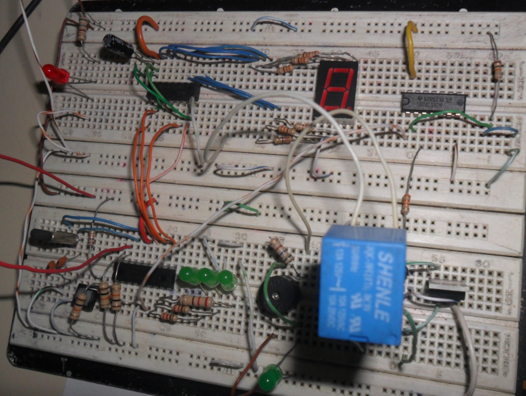
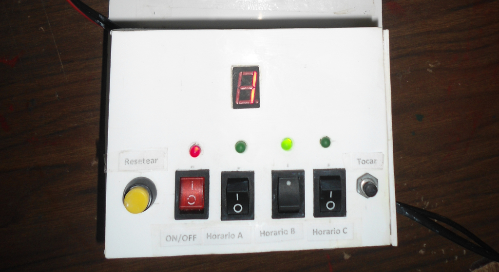

# Sirena Autocontrolada

> Proyecto de electrónica desarrollado como trabajado de grado en escuela secondaria.

La Sirena Autocontrolada es un dispositivo electrónico controlado por un microcontrolador
PIC 16F84A-4 que tiene como función gestionar las alertas realizadas con la sirena
eléctrica en el plantel principal para los cambios en el horario definido en él.

Ver [código fuente](./source.asm).

---------

Instituto Técnico Industrial Laureano Gómez Castro, Aguachica - Colombia, Noviembre del 2011.
